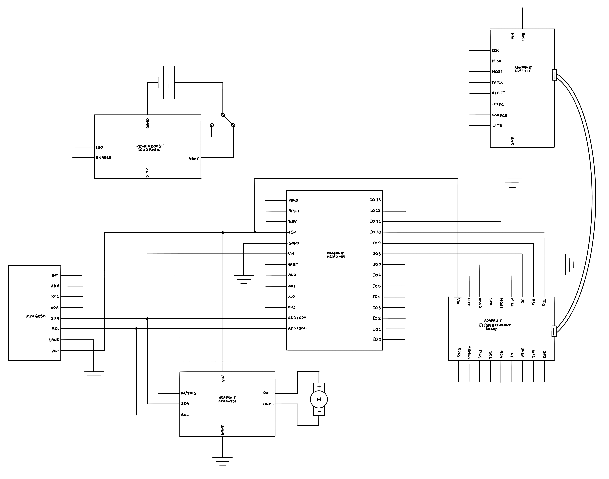

<!-- PROJECT LOGO -->
 

  <h3 align="center">Arduino Posture Corrector</h3>

  

  A small wearable device that alerts the user whenever they are slouching. Created for my embedded systems course at CUNY Hunter College during the Fall 2022 semester. 

<!-- TABLE OF CONTENTS -->

  
Table of Contents

  <ol>
    <li>
      <a href="#about-the-project">About The Project</a>
    </li>
    <li>
      <a href="#getting-started">Getting Started</a>
      <ul>
        <li><a href="#prerequisites">Prerequisites</a></li>
        <li><a href="#installation">Installation</a></li>
      </ul>
    </li>
    <li><a href="#license">License</a></li>
    <li><a href="#acknowledgments">Acknowledgments</a></li>
  </ol>

<!-- ABOUT THE PROJECT -->
## About The Project

The device is powered by a 3.7V Lithium Ion battery, boosted by the Adafruit PowerBoost 1000 to 5V. The boosted output is then fed into the Arduino and all other components so that they all work at the 5V logic level. The MPU-6050 Accelerometer-Gyroscope and DRV-2605L Haptic Motor Driver are connected to the Arduino using I2C communication, whereas the ST7789 TFT Display is connected to the Arduino using an SPI connection. 

The MPU-6050 serves as the project's sensor, gathering data on the project's orientation, acceleration, and temperature. Using the [MPU\_light](https://github.com/rfetick/MPU6050\_light/) Arduino library by rfetick on GitHub, I was able to fetch these values from the component. In order to sense whether a person is slouching or not, only the orientation values from the MPU-6050 are needed. 
If the pitch angle measured is greater than or equal to 3, then the user is alerted by the buzzing of the vibrating motor disc controlled by the DRV-2605L using the [Adafruit\_DRV2605](https://github.com/adafruit/Adafruit\_DRV2605\_Library) library to trigger the mini motor disc to vibrate. Additionally, the ST7789 TFT display is cleared and displays a new message insulting the wearer. Otherwise if the pitch angle is less than 3, the vibrating mini disc does not vibrate and the attached display shows a message complementing the wearer on their good posture. The screen graphics are written to using the [Adafruit\_GFX](https://github.com/adafruit/Adafruit-GFX-Library) and [Adafruit\_ST7789](https://github.com/adafruit/Adafruit-ST7735-Library) libraries. 

(<a href="#readme-top">back to top</a>)

### Built With
* [Adafruit Metro Mini](https://www.adafruit.com/product/2590)
* [MPU-6050 Gyroscope and Accelerometer](https://www.adafruit.com/product/3886)
* [DRV2605L Haptic Motor Controller](https://www.adafruit.com/product/2305)
* [Vibrating Mini Motor Disc](https://www.adafruit.com/product/1201)
* [Tactile Button Switch](https://www.adafruit.com/product/367)
* [PowerBoost 1000 Charger](https://www.adafruit.com/product/2465)
* [3.7V 4400mAh Lithium Battery Pack](https://www.adafruit.com/product/354)

Code written in C++ on the Arduino IDE.

(<a href="#readme-top">back to top</a>)

<!-- GETTING STARTED -->
## Getting Started
### Prerequisites
Be sure to install the necessary drivers for the Adafruit Metro Mini.
- If running Mac OS X, please use the [SiLabs drivers](https://www.silabs.com/products/development-tools/software/usb-to-uart-bridge-vcp-drivers).
- If running Windows, please install the [Windows Drivers for Adafruit products](https://github.com/adafruit/Adafruit_Windows_Drivers/releases/latest).
- Linux comes with the necessary drivers ready.

First, wire the components as shown in the schematic below and then upload the [sketch](arduino-posture-corrector/arduino-posture-corrector.ino) to the Arduino device.

	

(<a href="#readme-top">back to top</a>)

<!-- LICENSE -->
## License

Distributed under the GNU 3.0 License. See `LICENSE.txt` for more information.

(<a href="#readme-top">back to top</a>)

<!-- ACKNOWLEDGMENTS -->
## Acknowledgments
External ibraries used include:
- [MPU6050\_light by rfetick](https://github.com/rfetick/MPU6050\_light/) on GitHub downloaded on 12/18/2022
- [Adafruit\_DRV2605 by AdaFruit Industries](https://github.com/adafruit/Adafruit\_DRV2605\_Library) downloaded on 11/16/2022
- [Adafruit\_GFX by AdaFruit Industries](https://github.com/adafruit/Adafruit-GFX-Library) downloaded on 11/28/2022
- [Adafruit\_ST7789 by AdaFruit Industries](https://github.com/adafruit/Adafruit-ST7735-Library) downloaded on 11/28/2022 

(<a href="#readme-top">back to top</a>)

<!-- MARKDOWN LINKS & IMAGES -->
<!-- https://www.markdownguide.org/basic-syntax/#reference-style-links -->

